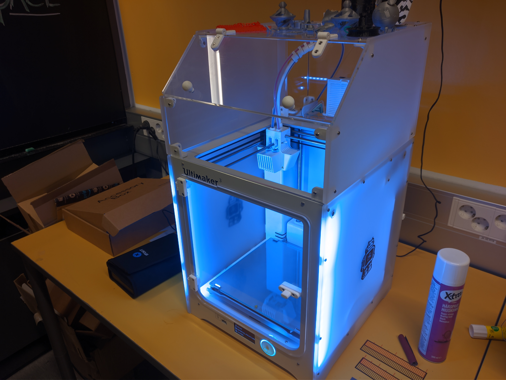
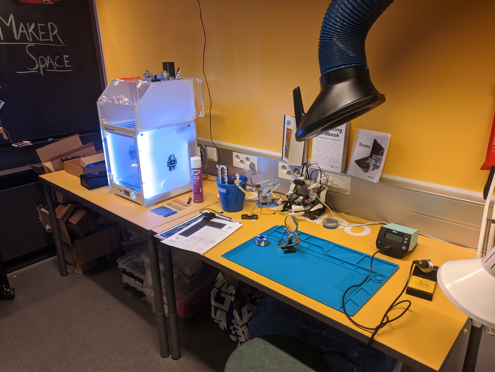

## Makerspace (Kumpula Helsinki Think Company)

#### Mikä on Makerspace?
Makerspace on Helsinki Think Companyn tiloissa toimiva pieni paja, jossa voit esimerkiksi tulostaa 3D-tulostimella, kolvata elektroniikkaa, rakentaa pieniä DIY-projekteja arduinoilla ja Raspberry PI:llä, korjata omia tavaroitasi ja laitteitasi tai vaikka vain lainata ruuvimeisseliä polkupyörän ruuvien kiristämiseen.

#### Miksi Makerspace?

Monia vastaavanlaisia pajoja on Helsingin seudulla melko vähän ja useimmat harrastelijaverstaista on melko kaukana ydinkeskustasta. Otaniemessä on Aalto-yliopiston opiskeijoille tarkoitettuja verstaita, jotka ovat myös verrattain kaukana Helsingin keskustassa ja Itä-Helsingissä asuville. Nykyään on olemassa myös kaupunkiverstas keskuskirjasto Oodissa, mutta jonka palvelujen käyttäminen vaatii ajanvarausta.

Tässä mielessä Kumpulan Makerspace eroaa näistä muista tiloista sillä, että sijaitsemme Kumpulan kampuksella, jonka takia paja on lähellä esimerkiksi kampuksella opiskelevia opiskelijoita. Tilan käyttämistä varten ei myöskään tarvitse varata aikaa, vaan tilaan voi tulla piipahtamaan milloin tahansa. Lisäksi Makerspacen käyttäminen on toistaiseksi ilmaista ja isompia projekteja on mahdollista ostaa omaksi pientä maksua vastaan.
#### Mitä Makerspacessa sitten voi tehdä?
Makerspacessa on tällä hetkellä käytössäsi 3D-tulostin **Ultimaker 3**.




Lisäksi käytössäsi on elektroniikan kolvaamista varten **Weller WE 1010 -juotinasema**.




Käytössäsi olevat komponentit:
```markdown

```

Katso tarkempi lista [täältä](# "täältä").
